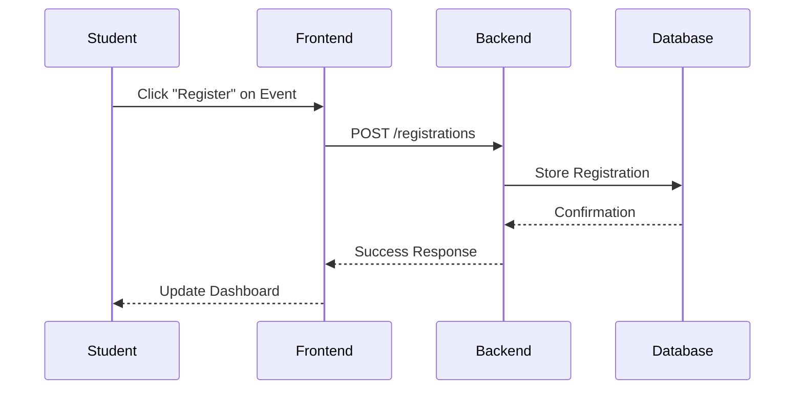

# Eventify - University Club Event Management Platform

  

Eventify is a comprehensive platform designed to streamline the management of university club events. It provides a range of features to help clubs organize, promote, and manage their events effectively.

  

## Index

- [Project Feature](#project-feature)

- [Technologies Used](#technologies-used)

- [Sample API Endpoints](#sample-api-endpoints)

- [Important Informations](#important-informations)

- [Team Members](#team-members)

- [License](#license)

  

### Project Feature

- **User Authentication**:

- Registration and Login System

- Role-based Access Control

  

- **User Profiles**:

- Users can create and manage their profiles, including their event registration history.

  

- **Admin Dashboard**:

- Admin have access to a dashboard for managing events.

- Admin can create, update, and delete events.

  

- **Student Dashboard**:

- Students can view and manage their registered events.

- Students can update their profiles and preferences.

  

- **Event Management**:

- Admin can create and manage events, including setting dates, times, locations, and descriptions.

- Users can register for events and receive notifications about event updates, making it easy to manage attendance.

- Event participants can receive certificates of participation, which are generated automatically after the event.

  

- **FAQ Chatbot**:

- A chatbot is available to answer frequently asked questions and assist users with common inquiries.

  

- **Miscellaneous Features**:

- Additional features include event analytics, showing the events with most registers and most views.

- Event search and filtering options to help users find relevant events easily.

- Event deadline management to ensure timely registrations and updates.

- Responsive and Mobile First Design

- Dark Mode Support

  

### Technologies Used

- **Frontend**: React.js for building user interfaces, tailwindcss for styling

- **Backend**: Node.js and Express.js for server-side logic

- **Database**: MongoDB for data storage

- **PDF Generation**: PDFKit for generating event certificates

- **System Designing Tool**: Eraser.io

  

## Sample API Endpoints

- POST /api/auth/register → Register user

- POST /api/auth/login → Login

- GET /api/events → Fetch all events

- POST /api/events/:id/register-event → Register for an event

  

## Important Informations:

- Live View: [Vercel - Eventify](https://eventify-vefw-pardek4cb-sql-srijons-projects.vercel.app)
  
- ERD: [Eventify - ERD](https://app.eraser.io/workspace/eX7Kui8KcNUkia5QRlGr)

- System Wireframe: [Eventify - Wireframe](https://app.eraser.io/workspace/TvyWb0GuTJ52saTJdFLE)

- Postman Collection: [Download Eventify.postman_collection.json](Eventify.postman_collection.json)

- Open Postman and Import the file for testing

### Prerequisites

  

- Node.js >= 14.x

  

- npm or yarn

  

- MongoDB (local or MongoDB Atlas)

  

- Vercel CLI (optional for deployment)

  

  

<details>

  

<summary>Backend (Node.js + Express)</summary>

  

  

1. Clone the repository:

  

```bash

git clone https://github.com/yourusername/Eventify.git 

```

  

2. Navigate to the backend directory:

  

```bash

cd Eventify/backend

```

  

3. Install dependencies:

  

```bash

npm install 

```

  

4. Create a `.env` file with placeholder values:

  

```plaintext

PORT=8000
MONGODB_URI=mongodb+srv://
CORS_ORIGIN=https:/
ACCESS_TOKEN_SECRET=
ACCESS_TOKEN_EXPIRY=1d
REFRESH_TOKEN_SECRET=bO
REFRESH_TOKEN_EXPIRY=10d
CLOUDINARY_CLOUD_NAME=dd
CLOUDINARY_API_KEY=71998569
CLOUDINARY_API_SECRET=zXjAos38fR
EMAIL_USER=cr
EMAIL_PASS=dxai
GOOGLE_CLIENT_ID=799
GOOGLE_CLIENTSECRET=GOCS
EMAIL_USER_EVENT=sa
EMAIL_PASS_EVENT=oki

```

  

5. Start the backend server:

  

```bash

npm start 

```

  

  

</details>

  

  

<details>

  

<summary>Frontend (React)</summary>

  

  

1. Navigate to the frontend directory:

  

```bash  

cd Eventify/frontend

```

  

2. Install dependencies:

  

```bash

npm install 

```

3. Create a `.env` file with placeholder values:

  

```plaintext

VITE_FORMSPREE_URL=htt
VITE_BACKEND_URL=http://localhost:8000/api/v1
VITE_GOOGLE_CLIENT_ID=79
VITE_GEMINI_API_KEY=AIzaSy

```  

4. Start the React development server:

  

```bash

npm run dev
  
```

 

4. Update `VITE_API_URL` in `.env` to point to your backend (e.g., `http://localhost:5000`).

 </details>  
  
  
  

## Team Members:


| **Name** | **Email** | **GitHub** | **Role** |
|---|---|---|---|
| **Sadik Rahman** | sadikrahman@gmail.com | [SadikRahman14](https://github.com/SadikRahman14) | Backend |
| **Eusha Ahmed** | eushaahmed08@gmail.com | [eushaahmed08](https://github.com/eushaahmed08) | Frontend |
| **Hasibur Rahman** | srijond57@gmail.com | [srijon57](https://github.com/srijon57) | UI/UX |

  
  

### Sequence Diagram

  

This diagram shows the sequence of interactions for registering an event.

  

  



  

### License

Eventify is licensed under the MIT License. See the [LICENSE](LICENSE) file for more information.
